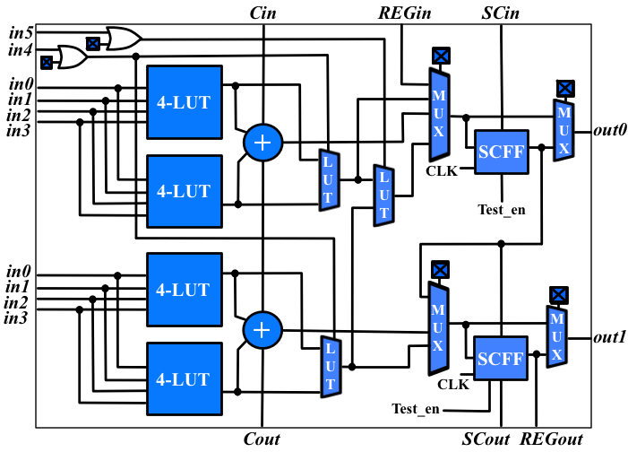
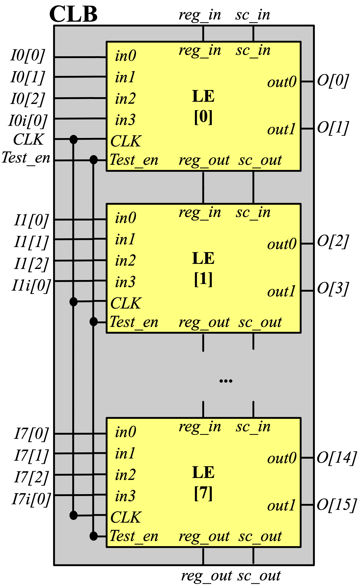

Configurable Logic Block User Guide
-----------------------------------

FROG's Configurable Logic Block (CLB) consists of 10 logic elements as shown in :numref:`fig_le_arch` and a 50% depopulated crossbar which tightly interconnects the logic elements.

.. _fig_le_arch:

  Logic Element

.. _fig_clb_arch:

  Configurable logic block and its chain connections across FPGA

