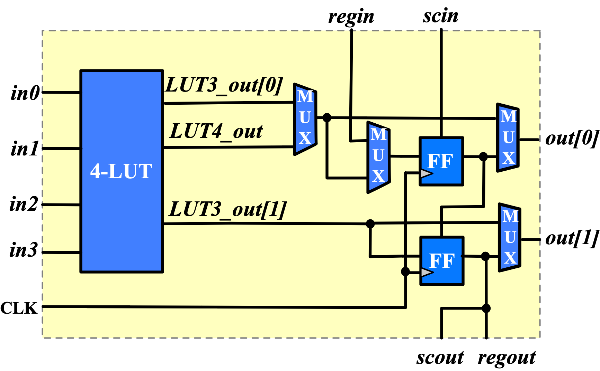

.. _clb:

Configurable Logic Block
------------------------

Each Configurable Logic Block (CLB) consists of 8 logic elements as shown in :numref:`fig_fle_arch`.

.. _fig_fle_arch:

  Schematic of a logic element

.. _fig_clb_arch:

.. figure:: ./figures/clb_arch.png
  :scale: 60%
  :alt: Configurable Logic Block schematic

  Configurable logic block and its chain connections across FPGA

