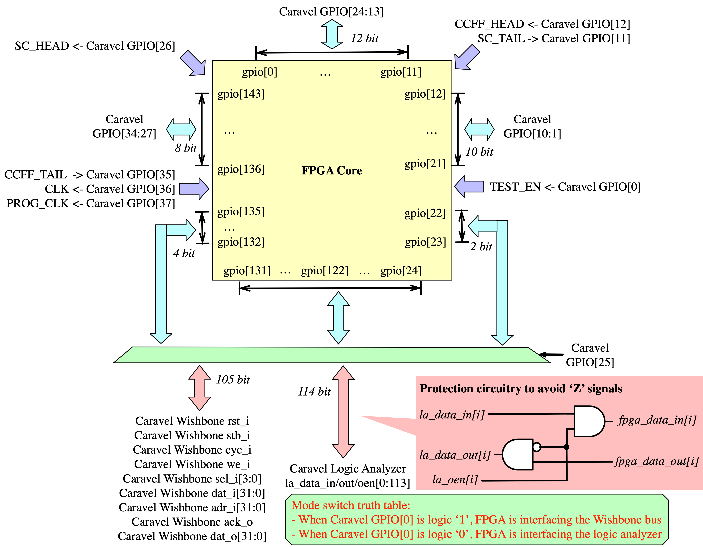
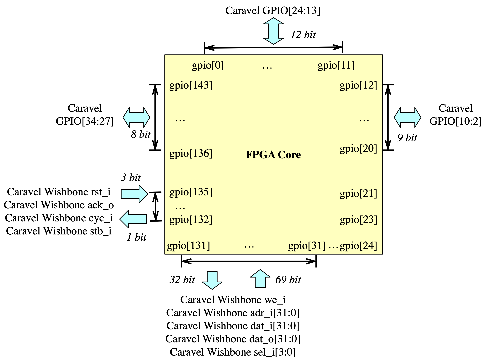
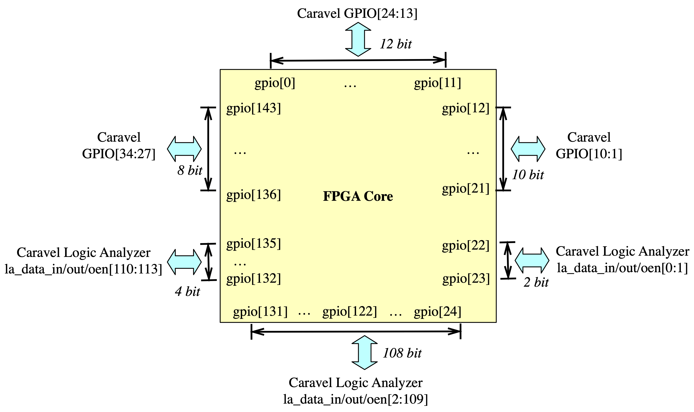
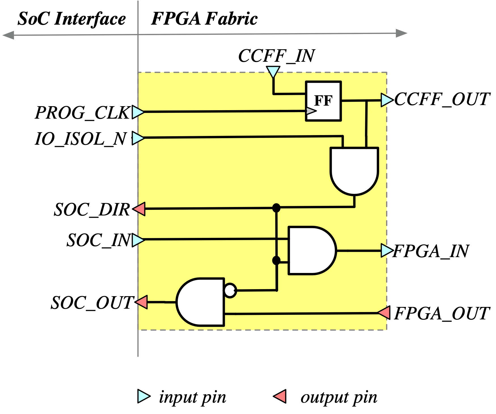

.. _io_resource:

I/O Resources
-------------

.. _io_resource_overview:

Overview
~~~~~~~~

The *High-Density* (HD) FPGA IP has 144 I/O pins as shown in :numref:`fig_fpga_io_switch`.

Among the 144 I/Os, 

- **29 external I/Os** are accessible through the Caravel SoC's *General-Purpose I/Os* (GPIOs).

- **115 internal I/Os** are accessible through the Caravel SOC's logic analyzer and wishbone interfaces, which are controlled by the RISC-V processor. See :ref:`io_resource_debug` and :ref:`io_resource_accelerator` for details. 

.. note:: The connectivity of the 115 internal I/Os can be switched through a GPIO of Caravel SoC. As a result, the FPGA can operate in different modes. 

.. _fig_fpga_io_switch:

  I/O arrangement of *High-Density* (HD) FPGA IP: switchable between logic analyzer and wishbone bus interface

.. _io_resource_accelerator:

Accelerator Mode
~~~~~~~~~~~~~~~~

When the Wishbone interface is enabled, the FPGA can operate as an accelerator for the RISC-V processor.
:numref:`fig_fpga_io_map_wishbone_mode` illustrates the detailed I/O arrangement for the FPGA, where the wishbone bus signals are connected to fixed FPGA I/O locations. 

.. note:: Not all the 115 internal I/Os are used by the Wishbone interface. Especially, the I/O[122:131] are not connected.

.. warning:: The FPGA does not contain a Wishbone slave IP. Users have to implement a soft Wishbone slave when use the FPGA as an accelerator.

.. _fig_fpga_io_map_wishbone_mode:

  I/O arrangement of *High-Density* (HD) FPGA IP when interfacing wishbone bus

.. _io_resource_debug:

Debug Mode
~~~~~~~~~~

When the logic analyzer interface is enabled, the FPGA can operate in debug mode, whose internal signals can be readback through the registers of the RISC-V processor.
:numref:`fig_fpga_io_map_logic_analyzer_mode` illustrates the detailed I/O arrangement for the FPGA, where the logic analyzer signals are connected to fixed FPGA I/O locations. 

.. note:: The logic analyzer is 128-bit, while 115 bits can drive or be driven by the FPGA I/O. The other 14 bits are connected to internal spots of the FPGA fabric, monitoring critical signal activities of the FPGA in debugging purpose.

.. _fig_fpga_io_map_logic_analyzer_mode:

  I/O arrangement of *High-Density* (HD) FPGA IP when interfacing logic analyzer

.. _io_resource_circuit:

FPGA I/O Circuit
~~~~~~~~~~~~~~~~

As shown in :numref:`fig_embedded_io_schematic`, the I/O circuit used in the I/O tiles of the FPGA fabric (see :numref:`fig_fpga_arch`) is an digital I/O cell with 

- An **active-low** I/O isolation signal ``IO_ISOL_N`` to set the I/O in input mode. This is to avoid any unexpected output signals to damage circuits outside the FPGA due to configurable memories are not properly initialized.

  .. warning:: This feature may not be needed if the configurable memory cell has a built-in set/reset functionality!

- An internal protection circuitry to ensure clean signals at all the SOC I/O ports. This is to avoid 
      
  - ``SOC_OUT`` port outputs any random signal when the I/O is in input mode
  - ``FPGA_IN`` port is driven by any random signal when the I/O is output mode

- An internal configurable memory element to control the direction of I/O cell 

The truth table of the I/O cell is consistent with the GPIO cell of Caravel SoC, where

- When configuration bit (FF output) is logic ``1``, the I/O cell is in input mode

- When configuration bit (FF output) is logic ``0``, the I/O cell is in output mode

.. _fig_embedded_io_schematic:

  Schematic of embedded I/O cell used in FPGA
