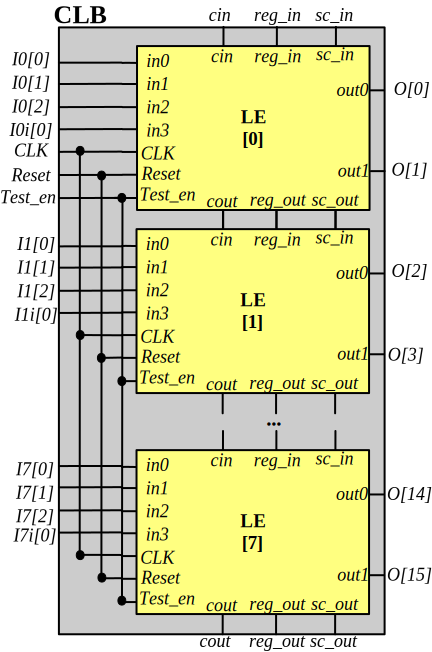
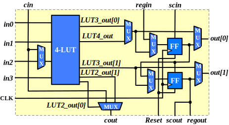
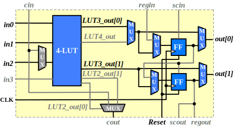
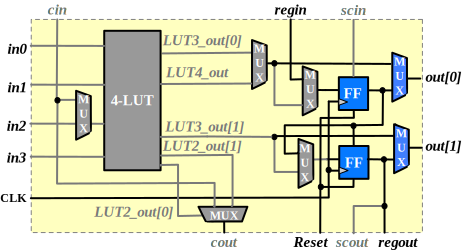
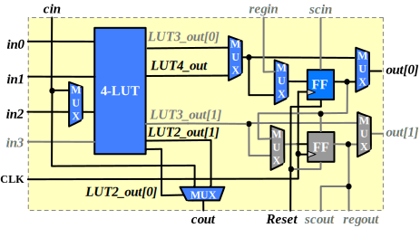

.. _qlsofa_hd_clb_arch:

Configurable Logic Block
------------------------

.. _qlsofa_hd_clb_arch_generality:

Generality
~~~~~~~~~~

Each Logic Block (CLB) consists of 8 Logic Elements (LEs) as shown in :numref:`fig_qlsofa_hd_clb_arch`.
All the pins of the LEs are directly wired to CLB pins without a local routing architecture.
Feedback connections between LEs are implemented by the global routing architecture outside the CLBs.

.. _fig_qlsofa_hd_clb_arch:

  Configurable logic block schematic

.. _qlsofa_hd_clb_arch_le:

Multi-mode Logic Element
~~~~~~~~~~~~~~~~~~~~~~~~

Physical Implementation
^^^^^^^^^^^^^^^^^^^^^^^

As shown in :numref:`fig_qlsofa_hd_fle_arch_schematic`, each Logic Element (LE) consists of

- a fracturable 4-input Look-Up Table (LUT)
- two D-type Flip-Flops (FF)

.. _fig_qlsofa_hd_fle_arch_schematic:

  Detailed schematic of a logic element

The LE can operate in different modes to map logic function efficiently

- 4-input LUT and single FF (see details in :ref:`qlsofa_hd_clb_arch_le_single_lut4_mode`).
- Dual 3-input LUTs and 2 FFs (see details in :ref:`qlsofa_hd_clb_arch_le_dual_lut3_mode`).
- 2-bit shift registers (see details in :ref:`qlsofa_hd_clb_arch_le_shift_reg_mode`).

.. _qlsofa_hd_clb_arch_le_single_lut4_mode:

Operating mode: LUT4 + FF
^^^^^^^^^^^^^^^^^^^^^^^^^

The logic element can operate in the Look-Up Table (LUT) + Flip-flop (FF) mode as many classical FPGA logic elements.
As depicted in :numref:`fig_qlsofa_hd_fle_arch_single_lut4_mode`, the fracturable LUT will operate as a single-output 4-input LUT and the upper FF is used to implemented sequential logic.

The operating mode is designed to efficiently implement 4-input functions. 

.. _fig_qlsofa_hd_fle_arch_single_lut4_mode:

.. figure:: ./figures/qlsofa_hd_fle_arch_single_lut4_mode.svg
  :scale: 30%
  :alt: Logic element schematic

  Resource usage of the logic element operating in LUT4 + FF mode (Grey blocks and lines are unused resources).

.. _qlsofa_hd_clb_arch_le_dual_lut3_mode:

Operating mode: Dual-LUT3
^^^^^^^^^^^^^^^^^^^^^^^^^

The logic element can operate in the dual Look-Up Tables (LUTs) and Flip-flops (FFs) mode as many modern FPGA logic elements.
As depicted in :numref:`fig_qlsofa_hd_fle_arch_dual_lut3_mode`, the fracturable LUT will operate as two 3-input LUTs with shared inputs.

The operating mode is designed to efficiently implement two 3-input functions with shared input variables. A popular example is the adder function, where the carry logic can be mapped to the upper LUT3 and the sum logic can be mapped to the lower LUT3. 

.. _fig_qlsofa_hd_fle_arch_dual_lut3_mode:

  Resource usage of the logic element operating in dual LUT3 + FFs mode (Grey blocks and lines are unused resources).

.. _qlsofa_hd_clb_arch_le_shift_reg_mode:

Operating mode: Shift-Register
^^^^^^^^^^^^^^^^^^^^^^^^^^^^^^

As depicted in :numref:`fig_qlsofa_hd_fle_arch_shift_register_mode`, the Flip-flops (FFs) can be connected in dedicated routing wires to implement high-performance shift registers.

The operating mode is designed to efficiently implement shift registers which are widely used in buffer logic, e.g., FIFOs. 

.. _fig_qlsofa_hd_fle_arch_shift_register_mode:

  Resource usage of the logic element operating in shift register mode (Grey blocks and lines are unused resources).

.. _qlsofa_hd_clb_arch_le_soft_adder_mode:

Operating mode: Soft Adder
^^^^^^^^^^^^^^^^^^^^^^^^^^

As depicted in :numref:`fig_qlsofa_hd_fle_arch_soft_adder_mode`, the 4-input LUT can implement an 1-bit adder logic, where carry inputs and outputs are connected through dedicated carry chain wires ``cin`` and ``cout`` across logic elements. This is more delay efficient than implementing adders through the dual LUT3 mode (see details in :ref:`qlsofa_hd_clb_arch_le_dual_lut3_mode`).

The operating mode is designed to efficiently implement multi-bit adders. 

.. _fig_qlsofa_hd_fle_arch_soft_adder_mode:

  Resource usage of the logic element operating in soft adder mode (Grey blocks and lines are unused resources).

.. _qlsofa_hd_clb_arch_scan_chain:

Scan Chain
~~~~~~~~~~

There is a built-in scan-chain in the CLB where all the `sc_in` and `sc_out` ports of LEs are connected in a chain, as illustrated in :numref:`fig_qlsofa_hd_clb_arch`.
When `Test_en` signal is active, users can readback the contents of all the D-type flip-flops of the LEs thanks to the scan-chain. 
When `Test_en` signal is disabled, D-type flip-flops of the LEs operate in regular mode to propagate datapath signal from LUT outputs. 

.. note:: The scan-chain of CLBs are connected in a chain at the top-level. See details in :ref:`qlsofa_hd_fpga_arch_scan_chain`.
