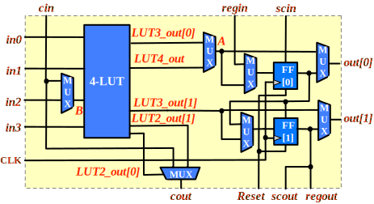

.. _qlsofa_hd_timing:

Timing Annotation
-----------------

.. _qlsofa_hd_timing_clb:

Configurable Logic Block
^^^^^^^^^^^^^^^^^^^^^^^^

The path delays in :numref:`fig_qlsofa_hd_fle_arch_timing` are listed in :numref:`table_sofa_hd_fle_arch_timing`.

.. _fig_qlsofa_hd_fle_arch_timing:

  Schematic of a logic element used in QLSOFA HD FPGA

.. _table_qlsofa_hd_fle_arch_timing:

.. table:: Path delays of logic element in the QLSOFA HD FPGA

  +-------------------------+------------------------------+
  | Path / Delay            | TT (unit: ns)                |
  +=========================+==============================+
  | in0 -> LUT3_out[0]      | 0.85                         |
  +-------------------------+------------------------------+
  | in1 -> LUT3_out[0]      | 0.57                         |
  +-------------------------+------------------------------+
  | in2 -> B                | 0.60                         |
  +-------------------------+------------------------------+
  |   B -> LUT3_out[0]      | 0.32                         |
  +-------------------------+------------------------------+
  | in0 -> LUT3_out[1]      | 0.90                         |
  +-------------------------+------------------------------+
  | in1 -> LUT3_out[1]      | 0.62                         |
  +-------------------------+------------------------------+
  |   B -> LUT3_out[1]      | 0.33                         |
  +-------------------------+------------------------------+
  | in0 -> LUT4_out         | 1.17                         |
  +-------------------------+------------------------------+
  | in1 -> LUT4_out         | 0.89                         |
  +-------------------------+------------------------------+
  | in2 -> LUT4_out         | 1.21                         |
  +-------------------------+------------------------------+
  | in3 -> LUT4_out         | 0.79                         |
  +-------------------------+------------------------------+
  | LUT3_out[0] -> A        | 0.56                         |
  +-------------------------+------------------------------+
  | LUT4_out[0] -> A        | 0.58                         |
  +-------------------------+------------------------------+
  | A -> out[0]             | 0.88                         |
  +-------------------------+------------------------------+
  | A -> FF[0]              | 0.56                         |
  +-------------------------+------------------------------+
  | FF[0] -> out[0]         | 0.88                         |
  +-------------------------+------------------------------+
  | LUT3_out[1] -> out[1]   | 0.89                         |
  +-------------------------+------------------------------+
  | LUT3_out[1] -> FF[1]    | 0.56                         |
  +-------------------------+------------------------------+
  | FF[1] -> out[1]         | 0.89                         |
  +-------------------------+------------------------------+
  | regin -> FF[0]          | 0.58                         |
  +-------------------------+------------------------------+
  | FF[0] -> FF[1]          | 0.56                         |
  +-------------------------+------------------------------+

.. _qlsofa_hd_timing_io:

I/O Block
^^^^^^^^^

The path delays of I/O blocks in QLSOFA HD FPGA is same as the SOFA HD FPGA. See details in :ref:`sofa_hd_timing_io`. 

.. _qlsofa_hd_timing_routing:

Routing Architecture
^^^^^^^^^^^^^^^^^^^^

The path delays in :numref:`fig_sofa_hd_routing_arch` are listed in :numref:`table_qlsofa_hd_routing_arch_timing`.

.. _table_qlsofa_hd_routing_arch_timing:

.. table:: Path delays of routing blocks in the QLSOFA HD FPGA

  +---------------------------+------------------------------+
  | Path / Delay              | TT (unit: ns)                |
  +===========================+==============================+
  | A -> B                    | 1.44                         |
  +---------------------------+------------------------------+
  | A -> C                    | 1.44                         |
  +---------------------------+------------------------------+
  | A -> D                    | 1.44                         |
  +---------------------------+------------------------------+
  | B -> E                    | 1.38                         |
  +---------------------------+------------------------------+

