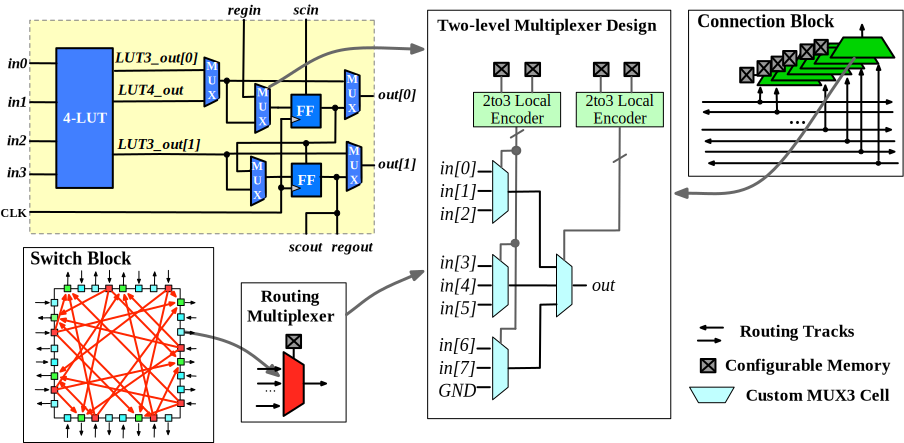
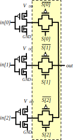

.. _sofa_chd_circuit_design:

Circuit Designs
---------------

.. _sofa_chd_circuit_design_io:

I/O Circuit
^^^^^^^^^^^

SOFA CHD FPGA share the same I/O circuit design as SOFA HD FPGA.
See details at :ref:`sofa_hd_circuit_design_io`.

.. _sofa_hd_circuit_design_mux:

Multiplexer
^^^^^^^^^^^

Routing multiplexer are designed by using a few custom cells based on the Skywater *High-Density* (HD) PDK, as shown in :numref:`fig_sofa_chd_mux_circuit`.
The multiplexer design follows a two-level structure, which is applied to all the routing multiplexers in logic elements, connection blocks and switch blocks across the FPGA fabric.

.. _fig_sofa_chd_mux_circuit:

  Schematic of multiplexer design in SOFA CHD FPGA

Each primitive in the two-level structure could be a 2/3/4-input custom cell, depending on the input size of the routing multiplexer.
Each custom cell is built with input inverters and transmission-gates.
For instance, :numref:`fig_sofa_chd_custom_mux_cells` shows the transistor-level design of a 3-input custom cell.

.. _fig_sofa_chd_custom_mux_cells:

  Detailed schematic of a 3-input custom cell in SOFA CHD FPGA

.. note:: Each routing multiplexer has a dedicated input which is connected to ground (GND) signal. When it is not used, the output will be driven by the ground, working as a constant generator.
