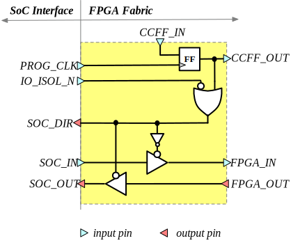
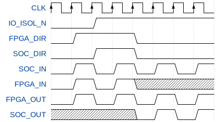
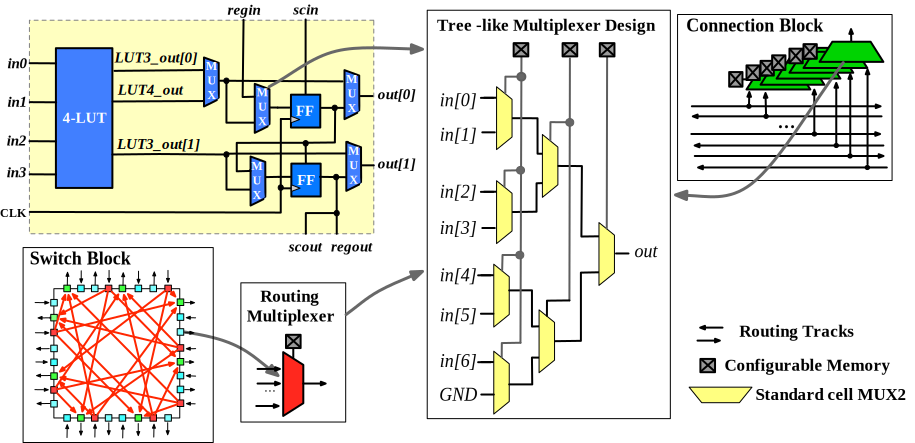

.. _sofa_hd_circuit_design:

Circuit Designs
---------------

.. _sofa_hd_circuit_design_io:

I/O Circuit
^^^^^^^^^^^

As shown in :numref:`fig_sofa_hd_embedded_io_schematic`, the I/O circuit used in the I/O tiles of the FPGA fabric (see :numref:`fig_sofa_hd_fpga_arch`) is an digital I/O cell with 

- An **active-low** I/O isolation signal ``IO_ISOL_N`` to set the I/O in input mode. This is to avoid any unexpected output signals to damage circuits outside the FPGA due to configurable memories are not properly initialized.

  .. warning:: This feature may not be needed if the configurable memory cell has a built-in set/reset functionality!

- An internal protection circuitry to ensure clean signals at all the SOC I/O ports. This is to avoid 
      
  - ``SOC_OUT`` port outputs any random signal when the I/O is in input mode
  - ``FPGA_IN`` port is driven by any random signal when the I/O is output mode

- An internal configurable memory element to control the direction of I/O cell 

The truth table of the I/O cell is consistent with the GPIO cell of Caravel SoC (which requires an active-low signal to enable output directionality), where

- When configuration bit (FF output) is logic ``1``, the I/O cell is in input mode

- When configuration bit (FF output) is logic ``0``, the I/O cell is in output mode

.. _fig_sofa_hd_embedded_io_schematic:

  Schematic of embedded I/O cell used in FPGA

:numref:`fig_sofa_hd_embedded_io_test_waveform` shows an example waveform about how the I/O cell works:

- When ``IO_ISOL_N`` is enabled/disabled
- When operates in input mode
- When operates in output mode

.. _fig_sofa_hd_embedded_io_test_waveform:

  An example of waveforms of embedded I/O cell used in FPGA

.. _sofa_hd_circuit_design_mux:

Multiplexer
^^^^^^^^^^^

Routing multiplexer are designed by using the skywater *High-Density* (HD) 2-input MUX cell, as shown in :numref:`fig_sofa_hd_mux_circuit`.
The tree-like multiplexer design is applied to all the routing multiplexers in logic elements, connection blocks and switch blocks across the FPGA fabric.

.. _fig_sofa_hd_mux_circuit:

  Schematic of multiplexer design in SOFA HD FPGA

.. note:: Each routing multiplexer has a dedicated input which is connected to ground (GND) signal. When it is not used, the output will be driven by the ground, working as a constant generator.
