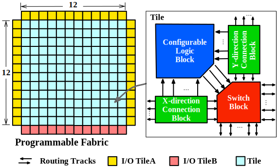
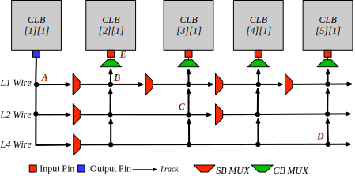

.. _sofa_hd_fpga_arch:

Architecture
-------------

.. _sofa_hd_fpga_arch_floorplan:

Floorplan
^^^^^^^^^

:numref:`fig_sofa_hd_fpga_arch` shows an overview on the architecture of the embedded FPGA fabric.
The FPGA follows a homogeneous architecture which only contains single type of tiles in the center fabric.
I/O tiles are placed at the boundary of the FPGA to interface with GPIOs and RISC-V processors (see details in :ref:`sofa_hd_io_resource`). 

.. _fig_sofa_hd_fpga_arch:

  Tile-based FPGA architecture

.. _sofa_hd_fpga_arch_tiles:

Tiles
^^^^^

The FPGA architecture follows a tile-based organization, to exploit the fine-grainularity in physical design, where three types of tiles are built:

.. table:: FPGA tile type and functionalities

  +------+----------+----------------------------------------------+
  | Type | Capacity | Description                                  |
  +======+==========+==============================================+
  | CLB  | 144      || Each CLB tile consists of                   | 
  |      |          || - a Configurable Logic Block (CLB)          |
  |      |          || - a X-direction Connection Block (CBx)      | 
  |      |          || - a Y-direction Connection Block (CBy)      |
  |      |          || - a Switch Block (SB).                      |
  |      |          |                                              |
  |      |          || This is the majority tile across the fabric |
  |      |          |  to implement logics and registers.          | 
  +------+----------+----------------------------------------------+
  | IO-A | 36       || The type-A I/O is a low-density I/O tile    |
  |      |          |  which is designed to mainly interface       |
  |      |          || the GPIOs of the SoC.                       |
  |      |          |                                              |
  |      |          || Each I/O-A tile consists of 1 digitial I/O  |
  |      |          |  cell.                                       |
  +------+----------+----------------------------------------------+
  | IO-B | 12       || The type-B I/O is a high-density I/O tile   |
  |      |          |  which is designed to mainly interface       |
  |      |          || the wishbone interface and logic analyzer   |
  |      |          |  of the SoC.                                 |
  |      |          |                                              |
  |      |          || Each I/O-B tile consists of 9 digitial I/O  |
  |      |          |  cells.                                      |
  +------+----------+----------------------------------------------+

.. _sofa_hd_fpga_arch_routing_arch:

Routing Architecture
^^^^^^^^^^^^^^^^^^^^

The routing architecture is based on uni-directional routing tracks, which are interconnected by routing multiplexers.
:numref:`fig_sofa_hd_routing_arch` illustrates the detailed organization of the routing architecture.

.. _fig_sofa_hd_routing_arch:

  Detailed routing architecture

The routing architecture consists the following type of routing tracks:

- Length-1 wires (``L1 wires``), which hop over 1 logic block (including I/O block)
- Length-2 wires (``L2 wires``), which hop over 2 logic block (including I/O block)
- Length-4 wires (``L4 wires``), which hop over 4 logic block (including I/O block)

Each tile includes two routing channels, i.e., the X-direction routing channel and the Y-direction routing channel, providing horizental and vertical connections to adjacent tiles.
Each routing channel consists of 40 routing tracks. See details in :numref:`table_sofa_hd_fpga_arch_routing_track_distribution`.

.. _table_sofa_hd_fpga_arch_routing_track_distribution:

.. table:: Routing track distribution of SOFA HD FPGA 

  +------------+------------------------------+
  | Track type | Number of tracks per channel |
  +============+==============================+
  | Length-1   | 6  (10%)                     |
  +------------+------------------------------+
  | Length-2   | 6  (10%)                     |
  +------------+------------------------------+
  | Length-4   | 28 (80%)                     |
  +------------+------------------------------+
  | Total      | 40                           |
  +------------+------------------------------+

.. _sofa_hd_fpga_arch_scan_chain:

Scan-chain
^^^^^^^^^^

There is a built-in scan-chain in the FPGA which connects the the `sc_in` and `sc_out` ports of CLBs in a chain (see details in :ref:`sofa_hd_clb_arch_scan_chain`), as illustrated in :numref:`fig_sofa_hd_fabric_scan_chain`.

When `Test_en` signal is active, users can 

- overwrite the contents of all the D-type flip-flops in the FPGA by feeding signals to the `SC_HEAD` port
- readback the contents of all the D-type flip-flops in the FPGA through the `SC_TAIL` port. 

.. _fig_sofa_hd_fabric_scan_chain:

.. figure:: ./figures/sofa_hd_fabric_scan_chain.svg
  :scale: 25%
  :alt: Built-in scan-chain across FPGA

  Built-in scan-chain across FPGA

