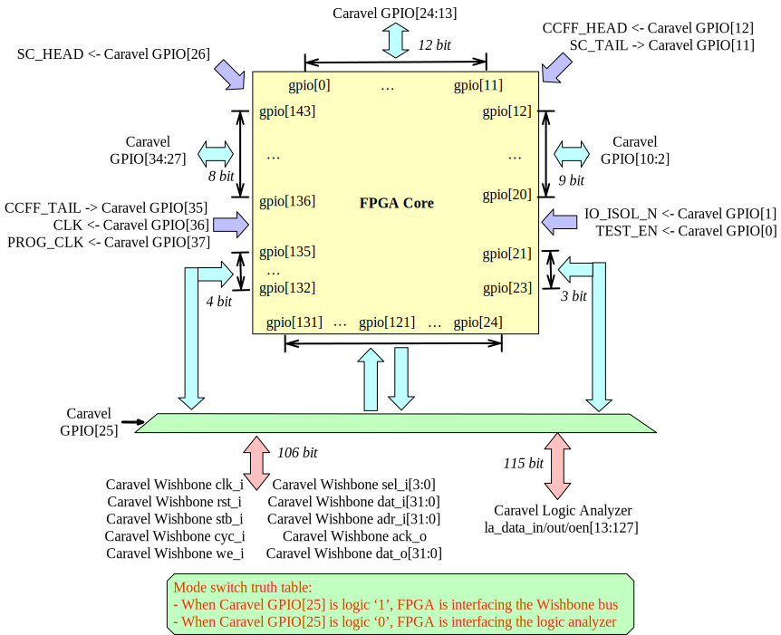

.. _sofa_hd_io_resource:

I/O Resources
-------------

DATA I/Os
^^^^^^^^^

The *High-Density* (HD) FPGA IP has 144 data I/O pins as shown in :numref:`fig_sofa_hd_fpga_io_switch`.

Among the 144 I/Os, 

- **29 external I/Os** are accessible through the Caravel SoC's *General-Purpose I/Os* (GPIOs).

- **115 internal I/Os** are accessible through the Caravel SOC's logic analyzer and wishbone interfaces, which are controlled by the RISC-V processor. See :ref:`sofa_hd_io_resource_debug` and :ref:`sofa_hd_io_resource_accelerator` for details. 

.. warning:: For all the unused GPIOs, please set them to **input** mode, so that the FPGA will not output any noise signals to damage other SoC components.

.. note:: The connectivity of the 115 internal I/Os can be switched through a GPIO of Caravel SoC. As a result, the FPGA can operate in different modes. 

.. warning:: The internal I/O pins will drive either Wishbone or the logic analyzer, following the same truth table as mode-switch bit in :numref:`fig_sofa_hd_fpga_io_switch`. 

.. _fig_sofa_hd_fpga_io_switch:

  I/O arrangement of *High-Density* (HD) FPGA IP: switchable between logic analyzer and wishbone bus interface

.. _io_resource_sofa_hd_external_io:

External I/Os
~~~~~~~~~~~~~

A SOFA HD FPGA IP contains 37 external I/O pins, including 29 data I/Os and 8 control I/Os.

Full details are summarized in the following table.

.. table:: SOFA HD FPGA I/O usage and sizes

  +-----------+------------------------------------------------------------------------+-------------+
  | I/O Type  | Description                                                            | No. of Pins |
  +===========+========================================================================+=============+
  | Data I/O  | Datapath I/Os of FPGA fabric                                           | 29          |
  +-----------+------------------------------------------------------------------------+-------------+
  | Clk       | Operating clock of FPGA core                                           | 1           |
  +-----------+------------------------------------------------------------------------+-------------+
  | ProgClk   | Clock used by configuration protocol to program FPGA fabric            | 1           |
  +-----------+------------------------------------------------------------------------+-------------+
  | CCin      | Input of configuation protocol to load bitstream                       | 1           |
  +-----------+------------------------------------------------------------------------+-------------+
  | CCout     | Output of configuration protocol to read back bitstream                | 1           |
  +-----------+------------------------------------------------------------------------+-------------+
  | TestEn    | Activate the test mode of FPGA fabric                                  | 1           |
  +-----------+------------------------------------------------------------------------+-------------+
  | SCin      | Input of built-in scan-chain to load data to flip-flops of FPGA fabric | 1           |
  +-----------+------------------------------------------------------------------------+-------------+
  | SCout     | Output of built-in scan-chain to read back flip-flops from FPGA fabric | 1           |
  +-----------+------------------------------------------------------------------------+-------------+
  | IO_ISLO_N | Active-low signal to enable I/O datapath isolation from external ports | 1           |
  +-----------+------------------------------------------------------------------------+-------------+
  | Total     |                                                                        | 37          |
  +-----------+------------------------------------------------------------------------+-------------+

.. _sofa_hd_io_resource_accelerator:

Accelerator Mode
~~~~~~~~~~~~~~~~

When the Wishbone interface is enabled, the FPGA can operate as an accelerator for the RISC-V processor.
:numref:`fig_sofa_hd_fpga_io_map_wishbone_mode` illustrates the detailed I/O arrangement for the FPGA, where the wishbone bus signals are connected to fixed FPGA I/O locations. 

.. note:: Not all the 115 internal I/Os are used by the Wishbone interface. Especially, the I/O[21:29] are not connected.

.. warning:: The FPGA does not contain a Wishbone slave IP. Users have to implement a soft Wishbone slave when use the FPGA as an accelerator.

.. _fig_sofa_hd_fpga_io_map_wishbone_mode:

.. figure:: ./figures/sofa_hd_fpga_io_map_wishbone_mode.svg
  :scale: 20%
  :alt: I/O arrangement of FPGA IP when interfacing wishbone bus

  I/O arrangement of *High-Density* (HD) FPGA IP when interfacing wishbone bus

.. _sofa_hd_io_resource_debug:

Debug Mode
~~~~~~~~~~

When the logic analyzer interface is enabled, the FPGA can operate in debug mode, whose internal signals can be readback through the registers of the RISC-V processor.
:numref:`fig_sofa_hd_fpga_io_map_logic_analyzer_mode` illustrates the detailed I/O arrangement for the FPGA, where the logic analyzer signals are connected to fixed FPGA I/O locations. 

.. note:: The logic analyzer is 128-bit, while 115 bits can drive or be driven by the FPGA I/O. The other 14 bits are connected to internal spots of the FPGA fabric, monitoring critical signal activities of the FPGA in debugging purpose.

.. warning:: If the logic analyzer is not used, please configure both the management SoC and the FPGA as follows: 

               - all the I/O directionality is set to **input mode**.
               - all the output ports is pulled down to **logic ``0``**.

.. _fig_sofa_hd_fpga_io_map_logic_analyzer_mode:

.. figure:: ./figures/sofa_hd_fpga_io_map_logic_analyzer_mode.svg
  :scale: 20%
  :alt: I/O arrangement of FPGA IP when interfacing logic analyzer

  I/O arrangement of *High-Density* (HD) FPGA IP when interfacing logic analyzer

