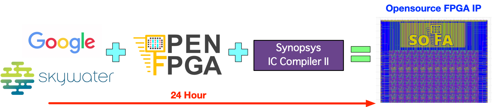

.. _device_family_introduction:

Introduction
------------

*Skywater Opensource FpgA* (SOFA) is a fully open-source embedded FPGA IP library, from the architecture description to production ready layouts.
As illustrated in :numref:`fig_sofa_motivation`, SOFA IPs are designed through the Skywater 130nm PDK, OpenFPGA framework and Synopsys IC Compiler II.
The runtime of the design flow for each IP is within 24 hours. 

All the SOFA FPGAs are designed to interface the Caravel SoC interface.
We aims to empower embedded applications with its low-cost design approach but high-density architecture.

.. _fig_sofa_motivation:

  24-hour FPGA IP development: from PDK to production-ready layout
