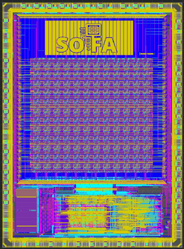
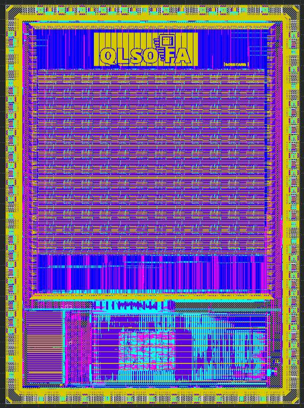
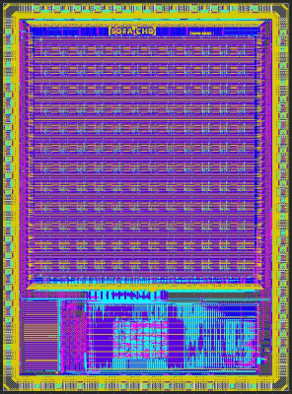

# SOFA
[](https://github.com/LNIS-Projects/skywater-openfpga/actions)
[](https://skywater-openfpga.readthedocs.io/en/latest/?badge=latest)

## Introduction

SOFA (**S**kywater **O**pensource **F**PG**A**s) are a series of open-source FPGA IPs using the open-source [Skywater 130nm PDK](https://github.com/google/skywater-pdk) and [OpenFPGA](https://github.com/lnis-uofu/OpenFPGA) framework.

This repository provide the following support for the eFPGA IPs
- **Architecture description file** : Users can inspect architecture details and try architecture evalution using the [VTR project](https://github.com/verilog-to-routing/vtr-verilog-to-routing) and the [OpenFPGA project](https://github.com/lnis-uofu/OpenFPGA).
- **Fabrication-ready GDSII layouts**: Users can integrate to their chip designs.
- **Post-layout Verilog Netlists**: Users can run HDL simulations on the eFPGA IPs to validate their applications
- **Benchmark suites**: An example benchmarking suite with which users can run quick examples on the eFPGA IPs
- **Documentation**: Datasheets for each eFPGA IPs downto circuit-level details

<p>
  
  
  
</p>

## Quick Start

To run the user flow using SOFA repository you need to have OpenFPGA installed.
Please visit https://github.com/lnis-uofu/OpenFPGA#compilation for OpenFPGA installaton.

```bash
export OPENFPGA_PATH=<path_to_openfpga_root>

# Clone the SOFA repository
git clone https://github.com/lnis-uofu/SOFA.git

# ======== Goto specific design ========
# FPGA1212_SOFA_CHD_PNR
# FPGA1212_QLSOFA_HD_PNR
# FPGA1212_SOFA_HD_PNR
cd FPGA1212_QLSOFA_HD_PNR

# ======== Run example OpenFPGA Task ========
make runOpenFPGA

# ======== To view the results ========
cat FPGA1212_QLSOFA_HD_task/latest/task_result.csv

# ======== To view detailed log ========
cat codeopen FPGA1212_QLSOFA_HD_task/latest/vpr_arch/top/MIN_ROUTE_CHAN_WIDTH/**/openfpgashell.log

```
### To bechmark your own design
Copy your verilog file `FPGA1212_QLSOFA_HD_task/micro_benchmark` directory
and modify `FPGA1212_QLSOFA_HD_task/config/task_simulation.conf` file.

Details of different paramters can be found [Configure run_fpga_task](https://openfpga.readthedocs.io/en/latest/manual/openfpga_flow/run_fpga_task/)

```bash
cd FPGA1212_QLSOFA_HD_PNR
vi FPGA1212_QLSOFA_HD_task/config/task_simulation.conf
```

---

## Documentation

You can find a chip gallery as well as datasheets in the [online documentation](https://skywater-openfpga.readthedocs.io/en/latest/)

## Directory Organization

* Keep this folder clean and organized as follows
  - **DOC**: documentation of the project
  - **ARCH**: Architecture XML and other input files which OpenFPGA requires to generate Verilog netlists
  - **BENCHMARK**: Benchmarks to be tested on the FPGA fabric
  - **HDL**: Hardware description netlists for the FPGA fabrics
  - **SDC**: design constraints
  - **SCRIPT**: Scripts to setup, run OpenFPGA etc.
  - **TESTBENCH**: Verilog testbenches generated by OpenFPGA
  - **PDK**: Technology files linked from skywater opensource pdk
  - **SNPS\_ICC2**: workspace of Synopsys IC Compiler 2
                    Keep a README inside the folder about the ICC2 version and how-to-use.
  - **MSIM**: workspace of verification using Mentor ModelSim

---

* Note:
  - Please **ONLY** place folders under this directory.
    README should be the **ONLY** file under this directory
  - Each EDA tool should have **independent** workspace in separated directories
